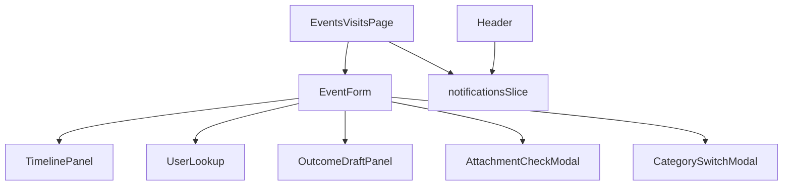
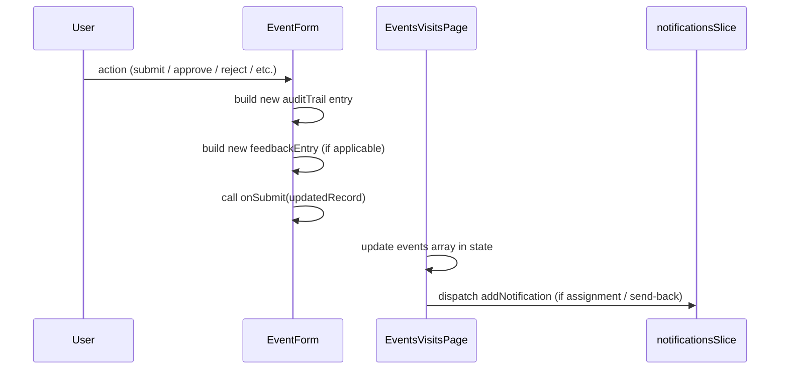

# Design Document: Event Registration Workflow Enhancement

## Overview

This design addresses ten workflow gaps in the PMIS Events & Visits module. The feature enhances the four-stage lifecycle (Draft → Pending Review → Approved → Pending Final Review → Completed) by adding: in-app assignment notifications with a filtered worklist, a validated user-lookup field for assignments, a "Send Back for Revision" path from final review, full pipeline visibility for Officers, attachment enforcement at status transitions, draft-save for outcomes, assignment due dates with overdue badges, populated Feedback and History timeline tabs, category-switch data-loss warnings, and a per-record audit trail inside the form view.

All changes are confined to the frontend React/TypeScript codebase. No backend or routing changes are required; the existing mock-data layer (`src/data.ts`) and local Redux state suffice for the frontend-only implementation.

---

## Architecture

The enhancement follows the existing project patterns:

- **State**: Local component `useState` inside `EventsVisitsPage` holds the events array (mirroring the current pattern). A new Redux slice (`notificationsSlice`) is added to `src/store/slices/` to centralise the in-app notification store and expose the badge count to the Header.
- **Components**: `EventForm.tsx` is the primary target for modification. New sub-components are extracted to keep the file manageable. New standalone components are placed in `src/components/`.
- **Types**: `src/types.ts` receives new fields on `EventRecord` and two new types (`AuditTrailEntry`, `FeedbackEntry`).
- **UI primitives**: All modals use the existing `Modal` component from `src/ui/`. Toasts use `sonner` (already in use). No new UI libraries are introduced.



### Data flow for status transitions



---

## Components and Interfaces

### Modified: `EventForm.tsx`

`EventForm` is refactored to delegate rendering responsibility to sub-panels. The component's internal state is extended:

```typescript
// New internal state fields
const [categoryBeforeSwitch, setCategoryBeforeSwitch] = useState<'Event' | 'Visit' | null>(null)
const [showCategorySwitchModal, setShowCategorySwitchModal] = useState(false)
const [showAttachmentWarning, setShowAttachmentWarning] = useState(false)
const [attachmentGateError, setAttachmentGateError] = useState<string | null>(null)
const [lastSavedOutcome, setLastSavedOutcome] = useState<OutcomeFieldSnapshot | null>(null)
const [showUnsavedChangesModal, setShowUnsavedChangesModal] = useState(false)
const [pendingNavAction, setPendingNavAction] = useState<(() => void) | null>(null)
const [activeTimelineTab, setActiveTimelineTab] = useState<'Status' | 'Feedback' | 'History'>(
  'Status'
)
```

The component gains three helper functions:

- `buildAuditEntry(action, actor, comment?)` — constructs a new `AuditTrailEntry` and appends it to `formState.auditTrail`.
- `buildFeedbackEntry(type, author, comment)` — constructs a new `FeedbackEntry` and appends it to `formState.feedbackEntries`.
- `hasUnsavedOutcomeChanges()` — compares current `outcomeForm` against `lastSavedOutcome`.

Props additions:

```typescript
type EventFormProps = {
  // existing props ...
  currentUser?: { id: string; name: string; role: string } // passed from EventsVisitsPage
  onNotify?: (notification: Omit<NotificationRecord, 'id'>) => void
}
```

### New component: `UserLookup.tsx` (`src/components/UserLookup.tsx`)

Replaces the free-text assignment input. Props:

```typescript
type UserLookupProps = {
  users: UserRecord[] // active users list
  value: string // display text
  selectedId: string | undefined
  onChange: (text: string) => void
  onSelect: (user: UserRecord) => void
  error?: string
  autoFocus?: boolean
}
```

Internal state: `query`, `open`, `highlightedIndex`. Filters users with case-insensitive substring match on `name`. Debounces the visible dropdown open/close by waiting until ≥2 characters. Supports keyboard navigation (ArrowUp/ArrowDown, Enter, Escape).

### New component: `TimelinePanel.tsx` (`src/components/TimelinePanel.tsx`)

Extracted from the inline `renderTimeline()` function in `EventForm`. Adds "Feedback" and "History" as real interactive tabs:

```typescript
type TimelinePanelProps = {
  record: EventRecord
  activeTab: 'Status' | 'Feedback' | 'History'
  onTabChange: (tab: 'Status' | 'Feedback' | 'History') => void
}
```

Renders:

- **Status tab**: existing four-node pipeline (unchanged logic).
- **Feedback tab**: iterates `record.feedbackEntries` (reverse-chronological). Empty state: "No feedback yet".
- **History tab**: iterates `record.auditTrail` (reverse-chronological). Empty state: "No history yet".

### New component: `OutcomeDraftPanel.tsx` (`src/components/OutcomeDraftPanel.tsx`)

Extracted from `renderOutcomeEditPanel()`. Adds "Save Draft" button and "Draft in progress" banner. Props:

```typescript
type OutcomeDraftPanelProps = {
  category: 'Event' | 'Visit'
  values: OutcomeFormState
  onChange: (values: OutcomeFormState) => void
  onSaveDraft: () => void
  onSubmit: () => void
  onCancel: () => void
  hasDraft: boolean
  revisionComment?: string // shown in "Revision Required" banner
  attachmentGateError?: string // inline error for report attachment
}
```

### New Redux slice: `notificationsSlice.ts` (`src/store/slices/notificationsSlice.ts`)

```typescript
type NotificationsState = {
  items: NotificationRecord[]
}

// Actions:
addNotification(item: Omit<NotificationRecord, 'id'>)
markRead(id: string)
markAllRead()
deleteNotification(id: string)
```

Selector `selectUnreadCount(state)` is used by `Header.tsx` to render the dynamic badge count.

### Modified: `Header.tsx`

The hardcoded `MOCK_NOTIFICATIONS` array and static dot badge are replaced:

- `const unreadCount = useSelector(selectUnreadCount)` drives the badge.
- The drawer renders notifications from `useSelector(selectNotifications)`.

### Modified: `EventsVisitsPage.tsx`

New state and handlers:

```typescript
const [myAssignmentsOnly, setMyAssignmentsOnly] = useState(false)

// "My Assignments" filter applied after existing filters
const filteredEvents = useMemo(() => {
  let result = events.filter(/* existing logic */)
  if (myAssignmentsOnly) {
    result = result
      .filter(e => e.assignedPersonId === currentUser?.id && e.status === 'Approved')
      .sort((a, b) => {
        if (!a.outcomeDueDate && !b.outcomeDueDate) return 0
        if (!a.outcomeDueDate) return 1
        if (!b.outcomeDueDate) return -1
        return a.outcomeDueDate.localeCompare(b.outcomeDueDate)
      })
  }
  return result
}, [events, searchQuery, activeFilters, myAssignmentsOnly, currentUser])
```

The toolbar gains a "My Assignments" toggle (visible only to the `Assigned Person` role). The list table gains an "Overdue" badge column cell rendered when `isOverdue(event)` is true.

---

## Data Models

### Extended `EventRecord` (additions to `src/types.ts`)

```typescript
// New assignment fields
assignedPersonId?: string          // FK to UserRecord.id
outcomeDueDate?: string            // ISO 8601 date-only: "YYYY-MM-DD"

// New outcome draft indicator
hasOutcomeDraft?: boolean

// New audit and feedback arrays
auditTrail?: AuditTrailEntry[]
feedbackEntries?: FeedbackEntry[]
```

### New type: `AuditTrailEntry`

```typescript
export type AuditTrailEntry = {
  actorName: string
  actorRole: string
  actionLabel:
    | 'Submitted'
    | 'Approved'
    | 'Rejected'
    | 'Assigned'
    | 'Outcome Submitted'
    | 'Completed'
    | 'Sent Back for Revision'
  previousStatus: EventRecord['status']
  newStatus: EventRecord['status']
  timestamp: string // ISO 8601 full datetime
  comment?: string // max 500 characters
}
```

### New type: `FeedbackEntry`

```typescript
export type FeedbackEntry = {
  type: 'Rejection' | 'Revision Request'
  authorName: string
  statusAtTime: EventRecord['status']
  timestamp: string // ISO 8601 full datetime
  comment: string
}
```

### Helper type: `OutcomeFieldSnapshot`

Used internally in `EventForm` to detect unsaved changes (not persisted):

```typescript
type OutcomeFieldSnapshot = {
  keyDiscussions: string
  agreementsReached: string
  actionPoints: string
  objectivesAchieved: string
  recommendations: string
  keyTopicsDiscussed: string
  visitAgreementsReached: string
  followUpActions: string
  opportunitiesIdentified: string
  attachmentsEventReport: AttachmentValue
  visitAttachmentsReport: AttachmentValue
}
```

---

## Implementation Approach Per Requirement

### Req 1 — Assigned Person Notification and Filtered Worklist

When `handleDgApprove` fires in `EventForm`, before calling `onSubmit`:

1. Call `onNotify({ title: 'You have been assigned', message: record.title, type: 'info', isRead: false, timestamp: now, link: deepLink })`.
2. `EventsVisitsPage` dispatches `addNotification` to `notificationsSlice`.

The "My Assignments" toggle is a button in `PageToolbar` (visible only when `role === 'Assigned Person'`). When active, `filteredEvents` applies the predicate and sort described in the Components section.

The notification badge in `Header` reads from `selectUnreadCount` instead of being a static dot.

### Req 2 — User Lookup for Assignment Field

The `isAssigning` branch in `EventForm` is replaced with the `UserLookup` component. The users list is fetched from `src/data.ts` (or the `useGetUsersQuery` hook if the API is available, with the data fallback). When the DG opens the panel for a record that already has `assignedPersonId`, the component is pre-populated by passing the matching user's name as the initial `value`.

Validation fires on "Verify & Assign" click: if `assignedPersonId` is undefined while `value` is non-empty, an inline error is rendered. If `outcomeDueDate` is empty, an inline "Outcome due date is required" error is shown. Both must pass before `handleDgApprove` is called.

### Req 3 — Final Review Rejection Path

A "Send Back for Revision" button is added alongside "Complete Registration" when `canFinalReview` is true. It opens a new modal (`SendBackModal`) distinct from the existing reject modal. On confirmation:

1. `onSubmit({ ...formState, status: 'Approved', reviewComment: revisionComment, feedbackEntries: [...(feedbackEntries), newFeedbackEntry], auditTrail: [...(auditTrail), newAuditEntry] })`.
2. `onNotify` is called with the revision comment addressed to `assignedPersonId`.

The `OutcomeDraftPanel` checks if the most recent `feedbackEntries` entry is of type `"Revision Request"` and, if so, renders the "Revision Required: [comment]" banner at the top of the panel.

### Req 4 — Officer Pipeline Visibility

`EventForm` always renders `TimelinePanel` when `mode === 'preview'` or `mode === 'edit'`, regardless of role (it was already visible; this confirms Officers see it too). The Feedback tab is now populated (see Req 8). The rejection banner is added directly in `renderDetailView`: when `formState.status === 'Rejected'`, a red alert banner shows `reviewComment || 'No rejection reason provided'` above the event details.

### Req 5 — Attachment Enforcement at Status Transitions

Two guards are added:

**Submit gate (Officer → Pending Review):**
`submitWithStatus('Pending Review')` first checks if all attachment fields for the current category are empty. If so, `setShowAttachmentWarning(true)` instead of calling `onSubmit`. The `AttachmentWarningModal` offers "Proceed Anyway" (calls `onSubmit`) and "Cancel".

**Outcome submit gate (Assigned Person → Pending Final Review):**
`handleSubmitOutcome` checks the required report field (`attachmentsEventReport` for Event, `visitAttachmentsReport` for Visit). If empty, `setAttachmentGateError(message)` is set and rendered as an inline error adjacent to that field inside `OutcomeDraftPanel`. The form is not submitted and the field scrolled into view via `ref.current?.scrollIntoView({ behavior: 'smooth' })` + `ref.current?.focus()`.

### Req 6 — Outcome Draft Save

`OutcomeDraftPanel` receives an `onSaveDraft` prop. When called:

1. `onSubmit({ ...formState, ...outcomeForm, hasOutcomeDraft: true })` — status does not change (remains `'Approved'`).
2. `setLastSavedOutcome(snapshot)` captures the current field values.
3. `toast.success('Draft saved', { duration: 3000 })`.

When the Assigned Person reopens an `Approved` record where `event.hasOutcomeDraft === true`, `OutcomeDraftPanel` shows the "Draft in progress" banner and pre-populates fields from the record's saved outcome fields.

Navigation-away guard: the back button in `renderHeader` and any action that calls `onCancel` first calls `hasUnsavedOutcomeChanges()`. If true, `setShowUnsavedChangesModal(true)` and `setPendingNavAction(() => actualAction)`. Confirming "Discard" runs the stored action; "Stay" dismisses the modal.

### Req 7 — Assignment Due Date

A `<input type="date">` labeled "Outcome Due Date" is added alongside `UserLookup` in the assignment panel. Validation on confirmation:

- Empty → "Outcome due date is required".
- Parsed date < today → "Due date must be today or in the future".

On valid assignment, the date string is stored as-is (the browser date input returns YYYY-MM-DD, which is ISO 8601 date-only).

In `EventsVisitsPage`, a helper `isOverdue(event: EventRecord)` returns `event.status === 'Approved' && !!event.outcomeDueDate && event.outcomeDueDate < todayString`. An "Overdue" badge (`bg-red-100 text-red-700`) is appended to the Status cell in the `DataTable` when this is true.

In `EventForm`'s `renderHeader`, when `isAssignedPerson && formState.outcomeDueDate`, the header subtitle includes `Outcome due by: ${formatDateDMY(formState.outcomeDueDate)}`.

### Req 8 — Feedback Tab Content

`buildFeedbackEntry` is called during:

- `handleDgReject` → type `"Rejection"`, status `"Rejected"`.
- Send Back for Revision confirmation → type `"Revision Request"`, status `"Approved"`.

The `FeedbackEntry` includes `authorName` from `currentUser.name` and `timestamp` from `new Date().toISOString()`.

`TimelinePanel`'s Feedback tab renders entries sorted by `timestamp` descending (same-timestamp ties broken by insertion order descending). Each card shows the type label (coloured: red for "Rejection", amber for "Revision Request"), author name, status-at-time badge, and timestamp formatted as `DD/MM/YYYY HH:MM`.

### Req 9 — Category Switch Data Loss Prevention

The `category` `<select>` onChange handler is replaced:

```typescript
const handleCategoryChange = (newCat: 'Event' | 'Visit') => {
  if (newCat === formState.category) return
  if (hasCategorySpecificData(formState)) {
    setCategoryBeforeSwitch(formState.category ?? 'Event')
    setShowCategorySwitchModal(true)
    setPendingCategorySwitch(newCat)
  } else {
    setFormState(prev => ({ ...prev, category: newCat }))
  }
}
```

`hasCategorySpecificData(record)` checks all Event-specific or Visit-specific fields (from the Glossary) for non-empty values (string with ≥1 char, number, or array with ≥1 element).

On "Switch & Clear": clear all fields for the old category to their empty defaults; set `category` to new value. Shared fields (`id`, `no`, `date`, `venue`, `status`, `estimatedBudget`, `actualBudget`, `fundingScore`) are untouched.

On "Cancel": `setShowCategorySwitchModal(false)`; `category` reverts to its value before the attempted change.

### Req 10 — Per-Record Audit Trail in Form View

`buildAuditEntry(actionLabel, actorName, actorRole, previousStatus, newStatus, comment?)` is called immediately before every `onSubmit` call in `EventForm`. Creating a Draft (`submitWithStatus('Draft')`) is the only action that does NOT call `buildAuditEntry`.

The built entry is appended to `formState.auditTrail` before calling `onSubmit`.

`TimelinePanel`'s History tab renders entries sorted by `timestamp` descending. Each entry shows:

- Status badge for `newStatus` using `statusConfig`.
- Actor name and role.
- Action label (`"Revision Requested →"` prefix for `"Sent Back for Revision"` entries, with the `"Approved"` color applied to the badge).
- Timestamp formatted as `DD/MM/YYYY HH:MM`.
- Comment block (visually distinct, e.g., `bg-slate-50 rounded p-2`) when `comment` is non-empty.

---

## Correctness Properties

_A property is a characteristic or behavior that should hold true across all valid executions of a system — essentially, a formal statement about what the system should do. Properties serve as the bridge between human-readable specifications and machine-verifiable correctness guarantees._

### Property 1: My Assignments filter correctness

_For any_ array of EventRecords with arbitrary `assignedPersonId` and `status` values, and for any current user id, when the "My Assignments" filter is applied, every returned record must have `assignedPersonId === currentUserId` AND `status === 'Approved'` — and no record satisfying both conditions shall be absent from the result.

**Validates: Requirements 1.2, 1.5**

---

### Property 2: My Assignments sort order

_For any_ list of EventRecords returned by the "My Assignments" filter, the list must be sorted by `outcomeDueDate` ascending, with null/undefined values appearing after all defined due dates.

**Validates: Requirements 1.3**

---

### Property 3: Notification badge increment

_For any_ initial notification array of length N addressed to a given user, after one new unread notification is added for that user, the computed unread count must equal N + 1.

**Validates: Requirements 1.4**

---

### Property 4: User lookup filter correctness

_For any_ query string of ≥2 characters and any list of active UserRecords, the filtered results must contain exactly those users whose `name` field includes the query as a case-insensitive substring — no more and no less.

**Validates: Requirements 2.2**

---

### Property 5: User lookup validation

_For any_ non-empty input string in the User_Lookup field where `assignedPersonId` is undefined, the assignment validation function must return a validation error and prevent the approval action from proceeding.

**Validates: Requirements 2.4**

---

### Property 6: Revision modal confirm-button state

_For any_ string of length 0, the Send Back for Revision confirm button must be disabled; _for any_ string of length 1 through 500, the confirm button must be enabled.

**Validates: Requirements 3.2, 3.6**

---

### Property 7: Due date validation

_For any_ date string representing a date strictly before the user's local calendar date, the due date validation must fail with an error. _For any_ date string representing today or a future date, the validation must pass.

**Validates: Requirements 7.2, 7.6**

---

### Property 8: Due date storage format

_For any_ valid due date confirmed during assignment, the `outcomeDueDate` field stored on the EventRecord must match the pattern `^\d{4}-\d{2}-\d{2}$` (ISO 8601 date-only).

**Validates: Requirements 7.3**

---

### Property 9: Due date display format

_For any_ valid ISO 8601 date-only string stored in `outcomeDueDate`, the formatted display value shown in the record header must match the pattern `DD/MM/YYYY`.

**Validates: Requirements 7.5**

---

### Property 10: Draft save preserves status

_For any_ set of outcome field values entered by an Assigned Person, activating "Save Draft" must persist all outcome field values to the EventRecord's state without changing the record's `status` (it must remain `'Approved'`).

**Validates: Requirements 6.2**

---

### Property 11: Outcome draft round-trip

_For any_ set of outcome field values saved as a draft, reopening the same EventRecord must pre-populate all outcome fields with those exact saved values.

**Validates: Requirements 6.3**

---

### Property 12: Unsaved changes detection

_For any_ pair of (currentOutcomeState, lastSavedOutcomeState) where at least one field value differs between them, the unsaved-changes guard must activate. When both states are identical, the guard must not activate.

**Validates: Requirements 6.5**

---

### Property 13: Feedback tab renders all entries

_For any_ array of `FeedbackEntry` objects on a record, the Feedback tab must render exactly that many entry cards, each containing the entry's type label, author name, status-at-time, and timestamp formatted as `DD/MM/YYYY HH:MM`.

**Validates: Requirements 8.1**

---

### Property 14: Feedback reverse-chronological order

_For any_ array of `FeedbackEntry` objects with varying timestamps, the Feedback tab must render them in reverse-chronological order (most recent first); among entries with identical timestamps, entries with a higher insertion index appear first.

**Validates: Requirements 8.5**

---

### Property 15: Category switch modal trigger

_For any_ form state where at least one field in the current category's specific field set is non-empty (string ≥1 char, number, or array ≥1 element), attempting to change the `category` selector must show the Category_Switch_Warning modal.

_For any_ form state where all fields in the current category's specific field set are at empty defaults, changing the `category` selector must switch immediately without showing the modal.

**Validates: Requirements 9.1, 9.5**

---

### Property 16: Category switch clears only old-category fields

_For any_ form state with populated fields in both the old and new category sets and populated shared fields, confirming "Switch & Clear" must set all old-category-specific fields to empty defaults and leave all shared fields unchanged.

**Validates: Requirements 9.3**

---

### Property 17: Category switch cancel is a no-op

_For any_ form state, clicking "Cancel" in the Category_Switch_Warning modal must leave the entire `formState` object identical to its state before the category change was attempted.

**Validates: Requirements 9.4**

---

### Property 18: Audit trail entry structure

_For any_ valid status-change action with any combination of actor name, actor role, previous status, and new status, the appended `AuditTrailEntry` must contain non-empty `actorName`, `actorRole`, a valid `actionLabel`, the correct `previousStatus`, the correct `newStatus`, and a valid ISO 8601 `timestamp`.

**Validates: Requirements 10.1**

---

### Property 19: Audit trail reverse-chronological order

_For any_ array of `AuditTrailEntry` objects with varying timestamps, the History tab must render them in reverse-chronological order (most recent first).

**Validates: Requirements 10.3**

---

### Property 20: Audit trail status badge colors

_For any_ `AuditTrailEntry` with a `newStatus` value defined in `statusConfig`, the status badge rendered in the History tab must use the CSS classes specified in `statusConfig` for that status value.

**Validates: Requirements 10.6**

---

## Error Handling

| Scenario                                    | Handling                                                                         |
| ------------------------------------------- | -------------------------------------------------------------------------------- |
| User lookup API unavailable                 | Fall back to `users` from `src/data.ts`; no error state shown to the DG          |
| Draft save failure (future API)             | Error toast "Draft could not be saved. Please try again."; form values unchanged |
| Assignment with no due date                 | Inline validation error before any state mutation                                |
| Assignment with past due date               | Inline validation error before any state mutation                                |
| Outcome submit missing report attachment    | Inline error + scroll to field + focus; no status transition                     |
| Category switch with dirty fields           | Confirmation modal; no data cleared until the user confirms                      |
| Navigation away from unsaved outcome        | Confirmation modal; no navigation until user confirms                            |
| Revision comment empty                      | Confirm button remains disabled; no mutation                                     |
| "Send Back" notification fails (future API) | Silent failure acceptable; status transition still completes                     |

---

## Testing Strategy

### Unit tests (Vitest + React Testing Library)

Unit tests focus on specific examples and edge cases:

- `UserLookup`: renders no results message when no active users match; pre-populates with existing assignment; keyboard navigation (ArrowDown, ArrowUp, Enter, Escape).
- `EventForm` — attachment gate: submit blocked when required report attachment missing; warning dialog offered when all attachments empty.
- `EventForm` — category switch: modal shown when dirty; modal skipped when clean; clearing old fields on confirm; no-op on cancel.
- `EventForm` — Send Back for Revision: status transitions to `'Approved'`; `reviewComment` set; `feedbackEntries` contains new "Revision Request" entry.
- `EventForm` — audit trail: Draft creation does not produce an `auditTrail` entry; Submit, Approve, Reject, Assign, Outcome Submit, Complete, Send Back each produce an entry with the correct `actionLabel`.
- `TimelinePanel`: "No feedback yet" shown when `feedbackEntries` is empty; "No history yet" shown when `auditTrail` is empty; "Sent Back for Revision" entry shows "Revision Requested →" prefix and "Approved" badge style.
- `notificationsSlice`: `addNotification` increments unread count; `markAllRead` sets all `isRead: true`.
- `EventsVisitsPage`: Overdue badge renders when `outcomeDueDate` is in the past and status is `'Approved'`; not rendered when due date is in the future.

### Property-based tests (fast-check, minimum 100 iterations each)

Each property test is tagged with a comment in the format:
`// Feature: event-registration-workflow-enhancement, Property N: <property text>`

All 20 correctness properties from the section above are implemented as property-based tests. The key generators are:

- **EventRecord generator**: randomly populated `assignedPersonId`, `status`, `outcomeDueDate`, `auditTrail`, `feedbackEntries` fields.
- **UserRecord generator**: random `name`, `id`, `status` (weighted toward `'Active'`).
- **Date string generator**: random past, present, and future ISO 8601 date-only strings.
- **OutcomeFormState generator**: random strings for all outcome text fields, including the empty-string case.
- **FeedbackEntry / AuditTrailEntry generators**: random field values with valid enum choices.

Properties 1 and 15 have dual branches (positive + negative) each counted as one property test with two assertions.

### Integration points

- `Header.tsx` ↔ `notificationsSlice`: verified by a single integration test confirming the badge count updates when a notification is dispatched via the events workflow.
- `EventsVisitsPage` ↔ `EventForm` ↔ assignment flow: an end-to-end test (using React Testing Library render of `EventsVisitsPage`) exercises the full DG approval path and confirms a notification is dispatched and the My Assignments list updates.
